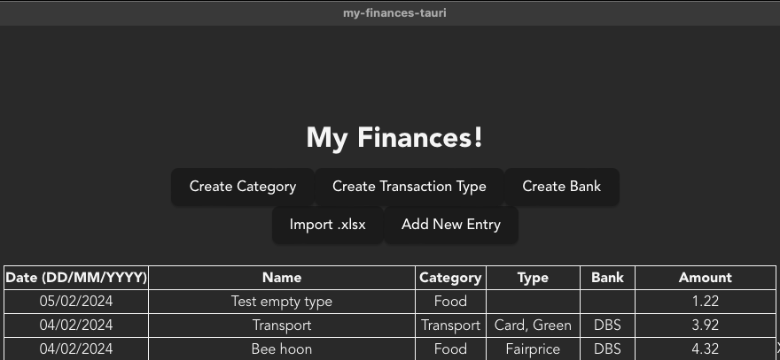
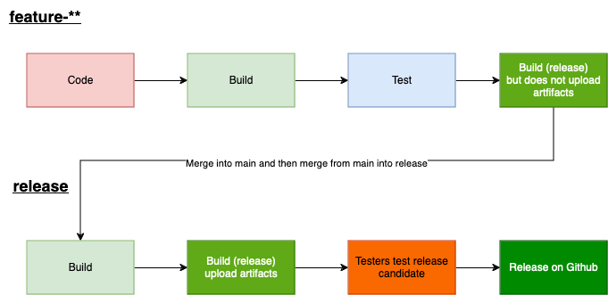
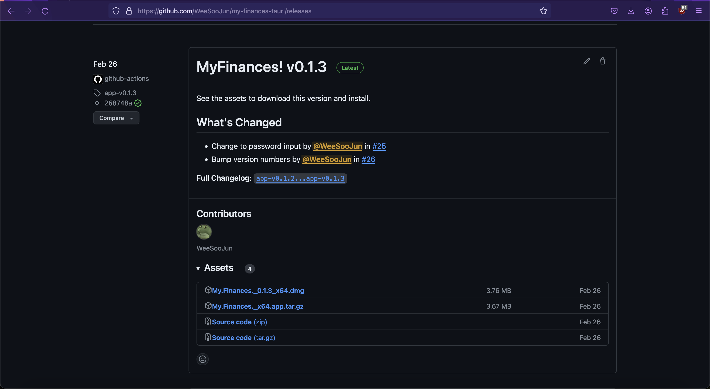

# My Finances!

## About

This is a desktop applications to track your finances (think average monthly spending across different categories and banks) and also a way to track cashback. You will be able to define your own transaction categories, types (paylah, paynow, card, online, etc.), and bank.

Currently there is only a version for MacOS Apple Silicon Chip (M series).

## Technical

Written using the Tauri Framework (similar to Electon but written in Rust) with a Rust backend, SQLite as local database, SolidJS + TailwindCSS as frontend.

## Recommended IDE Setup

- [VS Code](https://code.visualstudio.com/) + [Tauri](https://marketplace.visualstudio.com/items?itemName=tauri-apps.tauri-vscode) + [rust-analyzer](https://marketplace.visualstudio.com/items?itemName=rust-lang.rust-analyzer)

## How to start dev

Ensure that you have pnpm (or npm) installed, git clone to your locale then run

`pnpm install`

Subsequently to start a development version of the application run the following command below:

`pnpm tauri dev`

## Show & Tell

### feature-\*\* branch

In this branch developers will code and implement features/fix bugs/implement unit test, when the task to be fixed/implemented is ready, the developer push their code (updating changes to github repository) and a build will trigger when there is a push. This build will package the code, download and compile all dependencies and run unit test. The final step for this involvings building a release version and making sure it works without creating a new draft release

### release branch

This branch will occur after a feature-\*\* branch is merged and the main branch is merged into the release branch. A github action will then build a release version of the app and upload it as a draft release. Testers will then test this candidate version for release and once everything works the maintainer will release it on github as a release.

## Note

I currently do not have an apple account which is needed to notarise an application so the release files cannot be instead without explicitly allowing it in your apple settings
